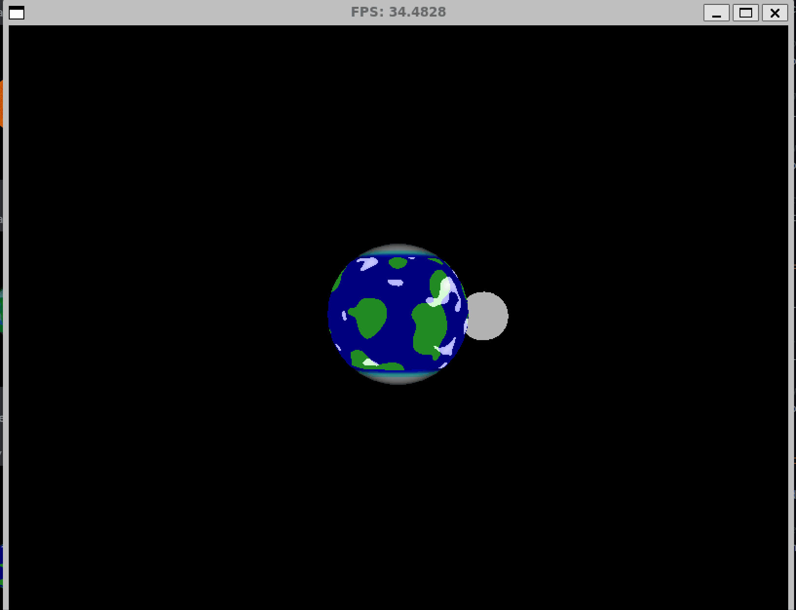
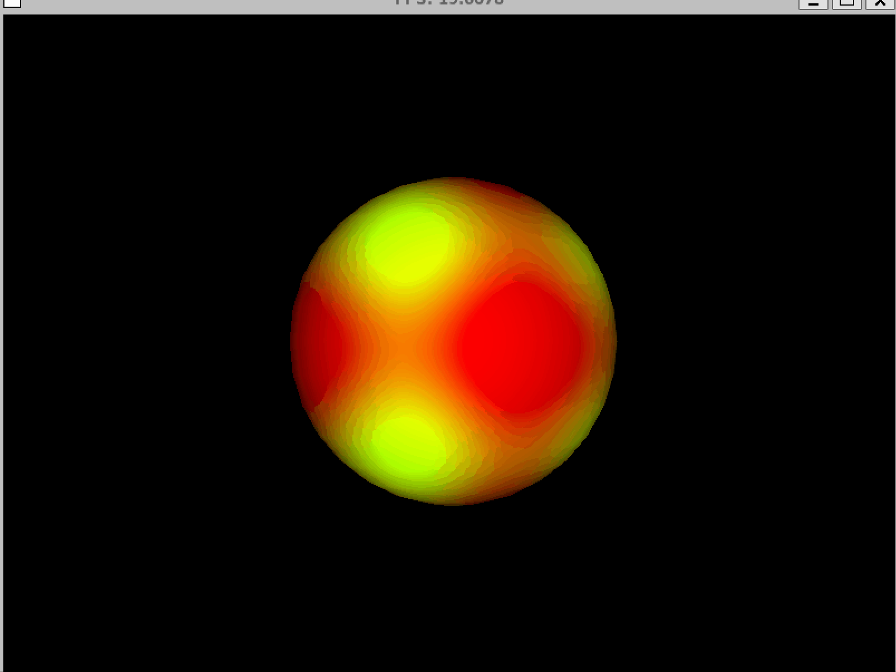

# GC-Shaders

## Documentación

## Planetas

### Earth


### Sun


### Jupiter


### Uranus


### Mars


### Random Planet


The objective of this lab was to render a three-dimensional model using raster graphics and shading techniques in the C++ language.

## Dependencies
- SLD2: Library used to create windows and render graphics.
- GLM: Mathematical Library for operations with vectors and matrices.

## Using Linux

First you need to install WSL, C++ with CMake, SDL and GLM

Then you need to run this command with the repository clone and in the folder SR-2-FLATSHADING

```shell
./run.sh
```
